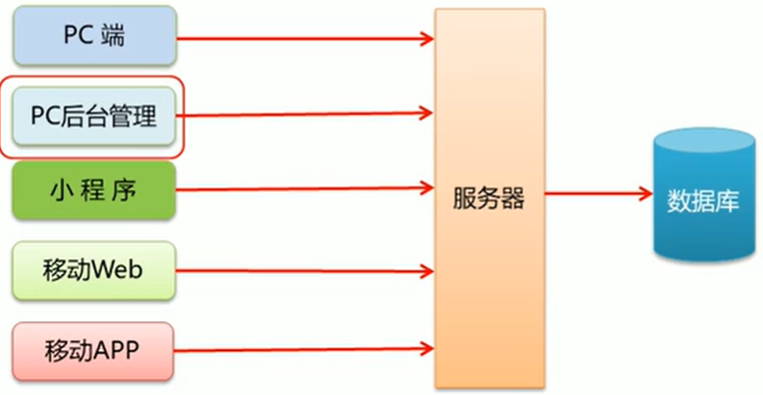
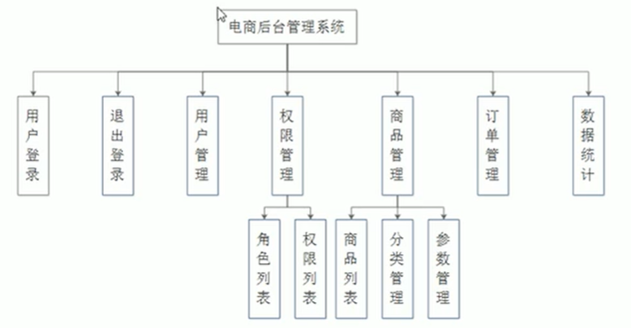
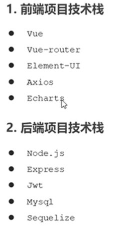
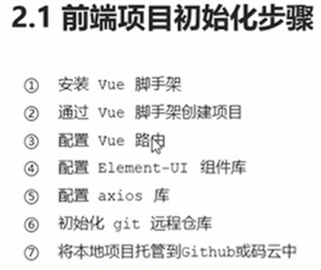
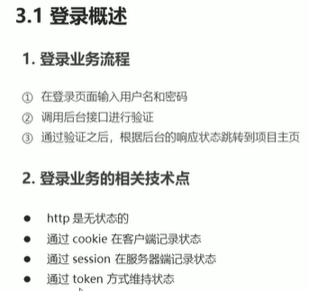
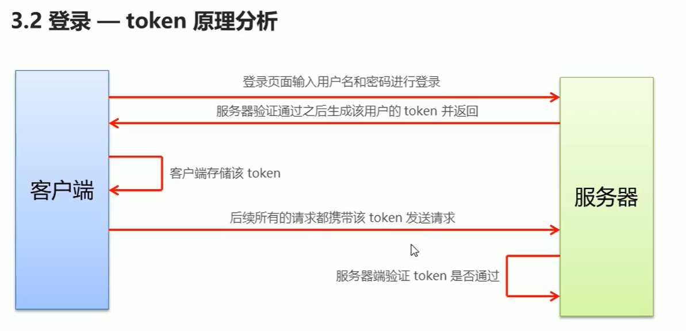
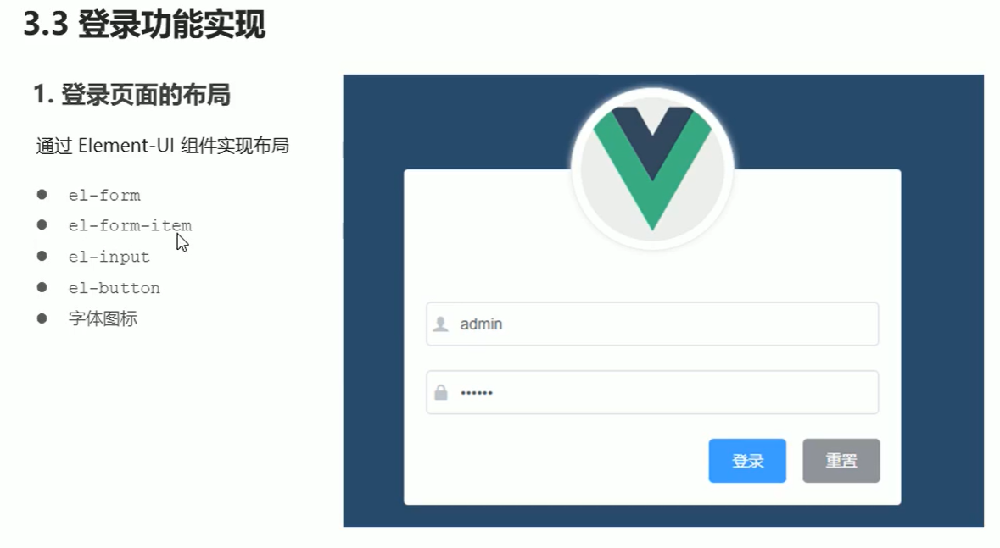

# Vue+element 电商PC端项目 目录

## 1. 项目概述

### 访问方式选择

电商系统一般提供了PC端、移动APP、移动Web、微信小程序等多种终端访问方式。

### 开发模式选择

前后端分离

### 开发技术选型

## 2. 项目初始化

## 3. 登录/退出功能

1. 表单布局
2. 表单组件、字体图标引用
3. 表单数据绑定
4. 表单验证

## 4. 主页布局

## 5. 用户管理模块

## 6. 权限管理模块

## 7. 参数管理模块

## 8. 商品列表模块

## 9. 订单管理模块

## 10. 数据统计模块

123213123